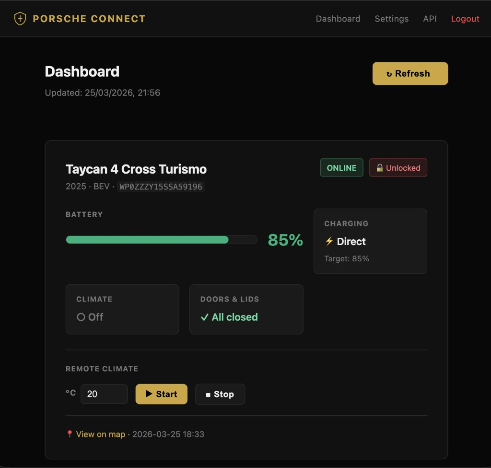
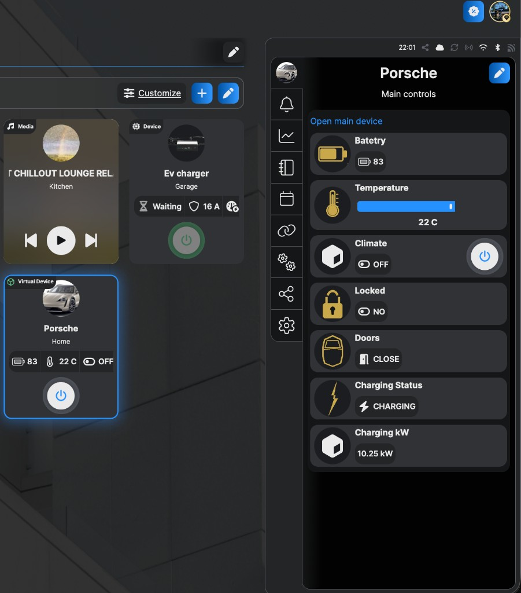

# Porsche EV — Shelly Connector

Connect your **Porsche Taycan, Macan EV, Panamera PHEV** (any Porsche Connect vehicle) to **Shelly virtual components** via the unofficial Porsche Connect API.

> ⚠️ This uses an unofficial API. Porsche may change it at any time. An active **Porsche Connect subscription** is required.

---

## Screenshots

### Web Dashboard


### Shelly Components


### Shelly App — Mobile


---

## Why connect Porsche to Shelly?

By bridging your Porsche to the Shelly ecosystem you unlock the full power of smart home automation:

### 🕐 1. Climate scheduling
Set recurring schedules directly in the Shelly app — preheat or pre-cool the cabin every weekday at 7:45 AM without touching the My Porsche app.

### 📊 2. Battery history
Shelly logs all component values over time. Track your battery level trends, charging patterns and range degradation through built-in charts — weeks and months of history.

### 🔔 3. Charging notifications
Trigger push notifications when charging starts or finishes. Get alerted if charging unexpectedly stops (e.g. cable disconnected, power outage) — directly to your phone via the Shelly app.

### ⚡ 4. Automatic load balancing
When the Taycan starts charging (`Charging kW > 0`), automatically turn off other high-power loads — water heater, dryer, dishwasher — to stay within your home's power limit. When charging ends, restore them automatically.

> **How:** Porsche Connect does not support remotely starting/stopping charging. Connect those other loads (not the EV charger) to Shelly relays — the script tells Shelly when the car is charging, Shelly handles the rest.

### 🛑 5. Stop charging at target %
Set the charging target via the Porsche app (e.g. 80%) — the car stops automatically. Use Shelly to *notify* you when the target is reached, or trigger other automations at that point.

> **Note:** Direct start/stop of charging is not available through Porsche Connect. To control the charger power itself you need a Shelly relay or smart plug between the wall outlet and the charger.

### ☀️ 6. Solar-aware charging
Monitor solar production with a Shelly energy meter. When solar output exceeds home consumption, send a push notification or trigger a scene reminding you to plug in. When solar drops, get alerted.

> **Full automation** (auto start/stop the charger based on solar) requires a Shelly relay on the charger power supply — then use the `Charging kW` and `Battery %` values from this script as triggers.

---

## What it does

A lightweight FastAPI server acts as a bridge between Porsche Connect and your Shelly device:

| Shelly Component | Data |
|---|---|
| `number:200` Battery % | Current state of charge |
| `number:201` Climate temp °C | Target temperature for climate (slider) |
| `number:202` Charging kW | Active charging power |
| `boolean:200` Climate | Toggle to start/stop remote climatisation |
| `boolean:201` Locked | Vehicle lock status |
| `boolean:202` Doors | All doors and lids closed? |

---

## Quick Start — Render.com (Free, no server needed)

> Best option for non-technical users. **Free tier** — kept alive by the Shelly 10-min poll.

### Step 1 — Fork this repo

Click **Fork** (top right) → Fork to your GitHub account.

### Step 2 — Deploy to Render

1. Go to [render.com](https://render.com) → Sign up (free) → **New** → **Web Service**
2. Connect your GitHub account → select your fork of this repo
3. Render auto-detects the `Dockerfile` ✓
4. Set these **Environment Variables** in the Render dashboard:

| Variable | Value |
|---|---|
| `PORSCHE_EMAIL` | your-myporsche@email.com |
| `PORSCHE_PASSWORD` | your-password |
| `PORSCHE_OVERVIEW_MODE` | `stored` |
| `REFRESH_INTERVAL_MINUTES` | `10` |
| `PORSCHE_TOKEN_FILE` | `/tmp/porsche_token.json` |

5. Click **Deploy** → wait ~2 min
6. Copy your URL: `https://porsche-connect-xxxx.onrender.com`

> 💡 **Why free tier works:** Render's free plan sleeps after 15 min of inactivity. The Shelly script polls every 10 minutes — keeping the server always awake.

### Step 3 — First login

Open your Render URL in browser → you'll see the login page.

**Default password: `porsche`** → change it immediately in Settings!

### Step 4 — Add your Porsche credentials

Settings → **My Porsche Account** → enter email + password → Save.

The server will connect to Porsche and cache your vehicle data.

### Step 5 — Copy your API key

Settings → **API Key** → Copy. You'll need it for the Shelly script.

---

## Shelly Setup

### Requirements
- Shelly Pro or Gen2+ device (1PM Mini Gen3, Pro 4PM, Plus 1, etc.)
- Firmware ≥ 1.1.0 (for virtual components support)

### Step 1 — Create virtual components

Go to your Shelly web UI → **Components** → **Add virtual component**:

| Type | ID | Label | View |
|---|---|---|---|
| Number | 200 | Battery % | label |
| Number | 201 | Climate temp °C | slider (min: 10, max: 30) |
| Number | 202 | Charging kW | label |
| Boolean | 200 | Climate | toggle |
| Boolean | 201 | Locked | label |
| Boolean | 202 | Doors | label |

### Step 2 — Install the script

1. Shelly web UI → **Scripts** → **Create script**
2. Name: `Porsche Connect`
3. Paste the contents of [`shelly_porsche.js`](./shelly_porsche.js)
4. Edit the top 3 variables:

```javascript
var API_BASE = "https://YOUR-RENDER-URL.onrender.com";  // your Render URL
var API_KEY  = "your-api-key-from-settings";            // from Settings → API Key
var VIN      = "WP0ZZZY1XXXXXXXX";                      // your VIN (My Porsche app → Vehicle)
```

5. **Save** → **Start**

### Step 3 — Verify

In the script console you should see:
```
[Porsche] Script started. VIN=WP0ZZZY... poll=600s
[Porsche] Polling...
[Porsche] Battery: 86%
[Porsche] Climate ON: false
[Porsche] Locked: true
[Porsche] Doors closed: true
[Porsche] Charging kW: 10.25
```

### Step 4 — Add to Shelly app

Open the **Shelly app** → your device → the Porsche virtual device will appear with all components. Customize the name, icon and room from the app.

---

## Self-hosting with Docker

```bash
git clone https://github.com/kmetabg/porsche-ev-shelly-connector.git
cd porsche-ev-shelly-connector
cp .env.example .env
# Edit .env — add PORSCHE_EMAIL and PORSCHE_PASSWORD
docker compose up -d
```

Open `http://localhost:8000` → login with password `porsche`.

---

## Supported vehicles

Any vehicle with an active **Porsche Connect** subscription:

| Model | From |
|---|---|
| Taycan (all variants) | 2019 |
| Macan EV | 2024 |
| Panamera (PHEV) | 2021 |
| Cayenne (E-Hybrid) | 2017 |
| 911 | 992 (2019) |
| Boxster / Cayman 718 | 2016 |

Check [connect-store.porsche.com](https://connect-store.porsche.com) to confirm your model is supported.

---

## API Endpoints

All endpoints require `?api_key=YOUR_KEY` or header `X-API-Key: YOUR_KEY`.

| Method | Endpoint | Description |
|---|---|---|
| GET | `/health` | Server + cache status |
| GET | `/vehicles` | List vehicles from cache |
| GET | `/vehicles/{vin}/battery` | Battery, charging, doors, lock status |
| GET | `/vehicles/{vin}/climate/start?temperature=21` | Start climate (async, instant response) |
| GET | `/vehicles/{vin}/climate/stop` | Stop climate (async, instant response) |
| POST | `/refresh` | Force cache refresh from Porsche API |

The `/climate/start` and `/climate/stop` endpoints return immediately with `{"status": "PENDING"}` — the command runs in the background. The Shelly script polls every 5 seconds to detect when the car confirms the action.

---

## Credits

- [pyporscheconnectapi](https://github.com/CJNE/pyporscheconnectapi) by Johan Isaksson — the Python library that makes this possible
- Porsche Connect API reverse-engineered by the open-source community

---

## Disclaimer

This project is **not affiliated with or endorsed by Porsche AG**. It uses an unofficial API that may break at any time. Use at your own risk.
